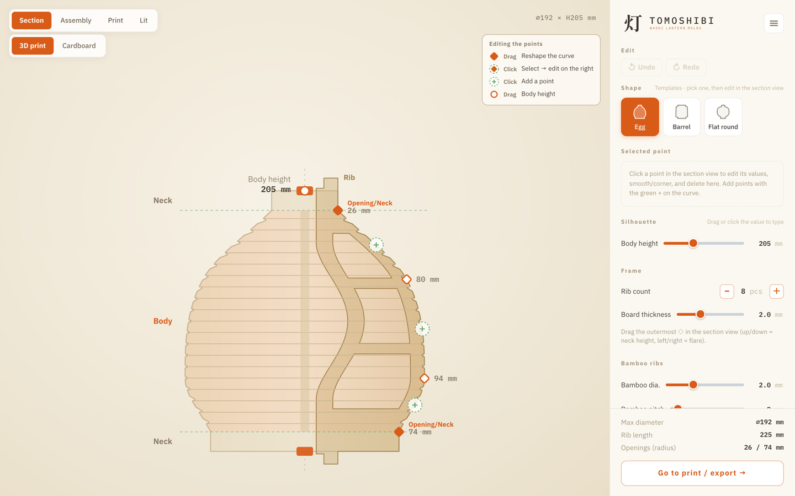
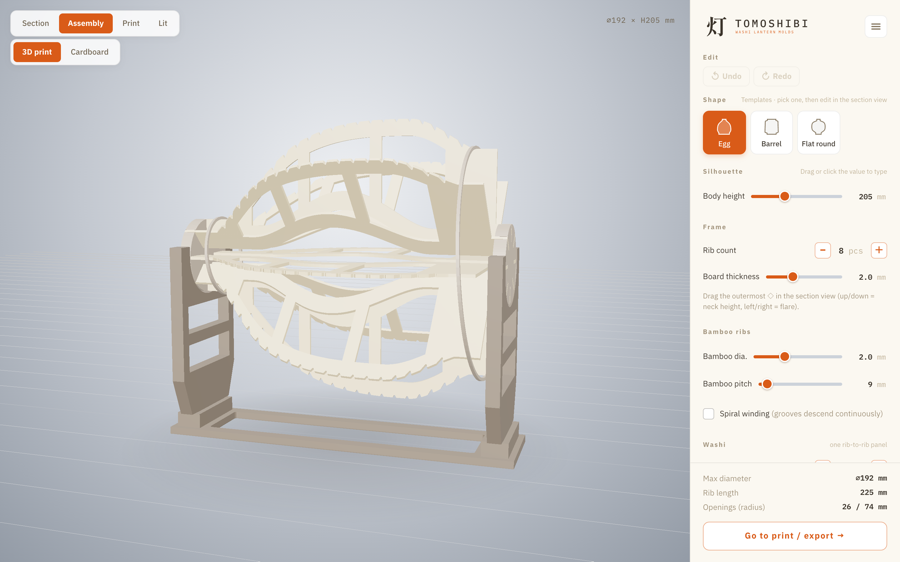
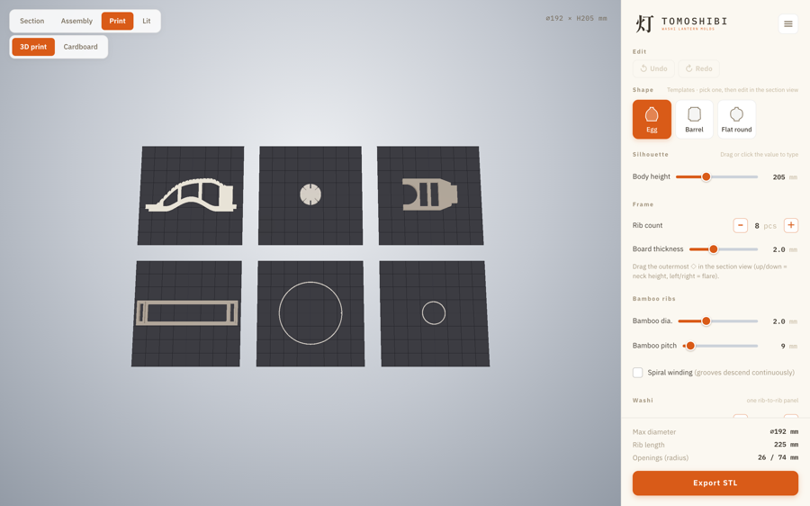
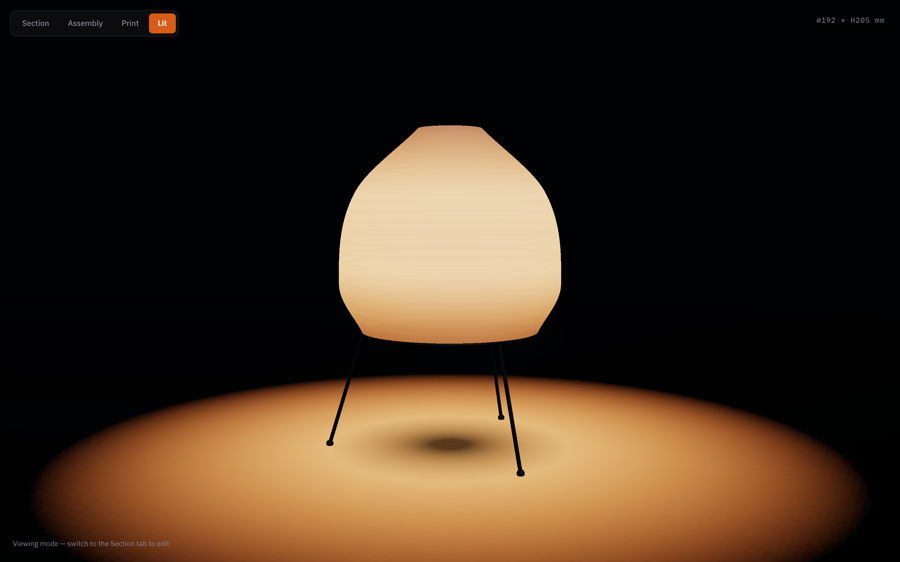

<p align="center">
  
</p>

<p align="center"><a href="README.md">English</a> · <b>日本語</b></p>

# 灯 Tomoshibi — 和紙提灯の張型ジェネレーター

和紙提灯（紙のランプ）を自作するための **3Dプリント用「張型（はりがた）」** を、ブラウザで
つくれます。断面を編集すると印刷用の STL が出ます。3Dプリンタが無ければ、同じ型を段ボールから
切り出すための**原寸 A4 型紙**が出ます。サーバは無く、すべてブラウザ内で動きます。

**→ [アプリを開く](https://shunyakoide.github.io/tomoshibi/)** — インストール不要。



*◇ をドラッグして輪郭をつくります。隣に描かれる羽根板の外形 — 溝も爪も肉抜き窓も含めて — は、STL が書き出されるのと同じジオメトリです。*

| 組立 | 印刷 | 点灯 |
| --- | --- | --- |
|  |  |  |
| 土台に載せた型。机から浮くので、巻きながら回せます。 | 全部品を自分のベッドに並べたところ。 | つくろうとしているもの。 |

---

## 何ができるか

提灯づくりの工程は「**型に竹ひごを巻く → 和紙を貼る → 乾いたら型をばらして開口から抜く**」。
その型を、自分でつくれる分割部品として出力するのが本アプリです。

| 部品 | 役割 |
| --- | --- |
| **羽根板** | 型の面をつくる放射状の板（N枚、オレンジの房のように）。外縁が火袋の曲線で、竹ひご用の V 溝が並びます。両端に爪。 |
| **コマ** | 歯車状のハブ、上下に同じものが2枚。縁のノッチが羽根板の爪を受けます。 |
| **土台** | 組んだ型を U 字サドル2つで受けて机から浮かせ、作業しながら回せるようにする台。3Dプリントのみ。 |
| **口輪** | 完成した提灯の2つの開口に貼る薄い平リング。コマを抜いたあとも開口の形を保ちます。**下側には脚ソケットを付けられます**（チェックボックス、初期値はオフ）— ⌀6 の穴を持つパッド3ヶ所で、脚は各自で用意します。開口が小さくて入らない場合は、内ふちに出っ張りを付けた輪のみになり、それが上下の見分けになります。 |

### 特長

- **断面の直接編集** — 制御点をドラッグして輪郭をつくります。3Dプレビューと STL は完全に一致します。
- **抜ける型** — 開口が小さく胴が深いと、羽根板が広すぎて、自分がつくった提灯から抜けなくなります。輪郭を触っている最中に、そのことと、各部品がベッドに収まるかどうかを測って知らせます。
- **竹ひごの溝** — 等間隔の V 溝に返しが付いていて、竹ひごが座って滑りません。**螺旋巻き**を選ぶと溝が羽根ごとにずれ、竹ひごが1本の連続した螺旋になります。このとき羽根板は1枚ずつ別形状になるので、通し番号を刻印した個別の STL として出ます。
- **段ボールルート**（beta） — 3Dプリンタが無くてもつくれます。原寸 A4 のページを印刷して段ボールから切り出します。
- **和紙の型紙** — 提灯の紙そのものを平面に展開したもの。羽根板と羽根板の間の1面を原寸で出すので、貼ったあとに切るのではなく**貼る前に切れます**。どちらのルートを選んでも同梱されます。
- **作り方ページ** — 独立したページ（アプリを置いた場所の `/guide`）。STL と同じ `geometry.ts` から図を描いていて、型づくりの先 — 竹ひごを巻く、和紙を貼る、乾かす、型を抜く、灯りをつける — まで通しています。
- **制作ノート** — 独立したページ（`/notes`、記事は `/note-…`）。作り方ページに入れると重くなるもの — 材料選び、失敗例、なぜこれをつくったのか — の置き場所です。該当する手順からは、そのノートへ直接リンクします。
- **英日 UI 切替** — ☰ メニューの1行。型紙も、アプリが表示している言語で印刷されます。
- **全パーツ水密** — 書き出される部品はすべて閉じた多様体で、自動スイープで検証しています（[CONTRIBUTING](CONTRIBUTING.md)）。

---

## 開発を始める

```bash
npm install
npm run dev        # http://localhost:8173  (--host 付きなので、同じ Wi-Fi のスマホから
                   # http://<PCのIP>:8173 で開けます)
npm run build      # dist/ に本番ビルド
npm run preview    # ビルド結果を http://localhost:8174 で確認
```

**Node.js 22.18+**（または 24+）が必要です。チェックスクリプトは `node` が直接実行する TypeScript
で、そのバージョンからフラグ無しで型が剥がされます。古い Node は動作が劣化するのではなく
`npm install` の時点で失敗します。

---

## 使い方

- **ビュータブ** — **断面 / 組立 / 印刷 / 点灯**。4つとも、目の前の設計をそのまま描いたものです。
- **右パネル** — プリセットを選び、断面の制御点をドラッグして形を調整します。下のセクション（骨組み・竹ひご・和紙・プリントベッド…）に細かい設定があります。
- **書き出し** — 印刷ビューから一式を ZIP でダウンロードします。設計のバックアップ `tomoshibi_config.json` が同梱されます。（STL はよく縮みます: 初期設定の一式で ZIP 約 190 KB。）
- **☰ メニュー** — はじめかたのカード、作り方、Notes（制作ノート）、言語、バックアップの保存・復元、初期化、そしてこのリポジトリへのリンク。

### 型から提灯まで

1. 部品をつくる。羽根板の爪を、コマ2枚のノッチに差し込む。
2. 組み上がりを土台に載せる。
3. 外縁の溝に竹ひごを巻き、その上から和紙を糊で貼る。
4. 乾かしてから、コマを（爪の側へ）抜き、羽根板を開口から抜き出す。
5. 2つの開口に口輪を貼り、自分で用意した灯りを付ける。

アプリの**作り方ページ**（☰ → 作り方）が同じ道筋を1ステップずつ図で説明し、自分で用意するものを
並べ、最後に灯りのつけ方を3通り示します — 床に置いたライトに被せる、上から吊るす、脚を付けて
下から留める。

### 段ボールルートと、和紙の型紙

> **段ボールは beta です。** 印刷パーツと同じ関数から寸法を出していて自動で検証もしていますが、
> 実際にこの方法でつくった人はまだ少ないです。粗いところがあるはずなので、合わなかったら
> issue を立ててください。

**段ボール**はプリンタの代わりに刃物と定規で足ります。印刷ビューから原寸 A4 の PDF が2つ
ダウンロードされます — 型紙（`tomoshibi_katagami_a4.pdf`）と和紙の型紙です。測った段ボールの厚みを
入力すると、コマのノッチがその厚みで切られるので、羽根板は糊も金具も無しで押し込むだけで留まります。
シートに載るのは羽根板・コマと、2つの口輪 — 口輪は**切る線ではなく、2mm の針金を曲げるための
青い線**です。土台はありません。何かの上に載せて使ってください。溝も切りません（0.5mm の V 溝は
段ボールには彫れません）。外縁は滑らかな曲線で、竹ひごの位置に破線の目盛りが入ります。
印刷は必ず **100%**、「用紙に合わせる」は不可。1枚に定規で測るためのチェック矩形が入っています。
1ページに収まらない高さの部品は次のページに続きます（両方のシートを青い枠で切り、コードの付いた
半分の◇が閉じるように突き合わせ、裏からテープ）。ただしページは縦にしか分割されないので、A4 の幅を
超える部品はそもそも入りません — 印刷する前にアプリが知らせます。

**和紙の型紙**は1面を原寸で描いたものです。隣り合う羽根板の間の面を平面に展開し、横の重ねしろと、
開口に折り返すぶんの余裕を含みます。和紙の下に敷いて（透けます）なぞり、貼りはじめる前に N 面
すべて切っておきます — 貼った濡れた縁を切るのが一番厄介で、しかも仕上がりに出ます。長さは胴の
高さではなく、**曲線に沿った長さ**です。二重に曲がった面を平面に開くのは原理的に近似なので、
まず1面だけ切って当ててみてください。

---

## 技術構成

意図的に最小限 — Vite + React 19 + three.js、書き出し ZIP に fflate、TypeScript。PDF はアプリ自身が
依存なしで書いています。ジオメトリは three.js の `Shape`/`ExtrudeGeometry` を返す純粋関数で、
断面の2D描画・3Dプレビュー・STL・2種類の型紙がすべて同じ関数を読みます。見えているものが
印刷されるものである、というのはそれで担保しています。

## コントリビュート

ジオメトリの変更は**水密**を保つ必要があります。開発環境と検証ゲート（`lint` / `typecheck` /
`check:manifold` / `check:hash` / `check:persist` / `check:paper` / `check:glyphs` / `check:i18n` /
`check:style`）は [CONTRIBUTING.md](CONTRIBUTING.md) にあります。CI は push と PR のたびに全部を
回しますが、`check:hash` だけは前後の比較が要るのでローカルで、STL が変わらないはずの変更の前後に
実行します。型そのものの設計判断 — 各部品の役割、印刷嵌合の不変条件、なぜその寸法なのか — は
`src/geometry/` 各モジュールの冒頭コメントに、その値のすぐ隣に書いてあります。

## ライセンス

[MIT](LICENSE) © 2026 Shunya Koide
